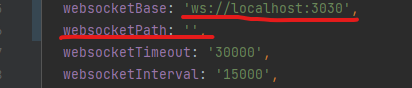

# Descripción

Proyecto creado para levantar un servidor local de socket.io y disparar eventos localmente

## Cómo levantar el proyecto?

1. Clonar el proyecto en tu local
2. Abrir una ventana de comando y ejecutar en la raiz del proyecto `npm install`
3. Ejecutar el script start con el comando `npm run start`.
4. Abrir en el navegador la ruta http://localhost:3030/sendEvent .
5. Configurar tu proyecto local para que apunte a la ruta de eventos `ws://localhost:3030/socket.io/`
Ejemplo de enviroment:
   

### ToDo

- [x] Permitir recargar desde el historial un evento lanzado anteriormente
- [x] Brindar la opción de poder configurar el endpoint para subscribirse de forma dinámica

### Dev By: JLRH